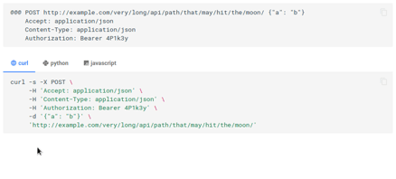

# mkdocs-apicall-plugin

[](https://github.com/asiffer/mkdocs-apicall-plugin/actions/workflows/build.yaml)
[](https://github.com/asiffer/mkdocs-apicall-plugin/actions/workflows/publish.yaml)
[](https://badge.fury.io/py/mkdocs-apicall-plugin)

Automatically insert code snippets to run API calls



## Installation

```shell
pip install mkdocs-apicall-plugin
```

This plugin works with the [material](https://squidfunk.github.io/mkdocs-material/) theme and is built on top of the [`tabbed`](https://facelessuser.github.io/pymdown-extensions/extensions/tabbed/) and [`superfenced`](https://facelessuser.github.io/pymdown-extensions/extensions/superfences/) extensions from PyMdown. Enable the extensions and the plugin in your `mkdocs.yml`:

```yaml
theme:
  name: material

markdown_extensions:
  - pymdownx.superfences
  - pymdownx.tabbed:
      alternate_style: true

plugins:
  - apicall
```


## Syntax

The syntax is given below. Basically it may look like a classical HTTP request message.

```ini
@@@ <METHOD> <PATH> [<PAYLOAD>]
    [<HEADER-KEY>: <HEADER-VALUE>]
    [<HEADER-KEY>: <HEADER-VALUE>]
```

The method and the paths are both mandatory. 
One can append a payload (only a json for the moment) to the first line.
The following lines are extra indented HTTP headers.

## Configuration

The plugin supports few options:

**`line_length`** [`int`] is the maximum length of a line of code before splitting into several lines.

**`icons`** [`bool`] activates language icons. You must add the following extensions:

```yaml
markdown_extensions:
  # ...   
  - attr_list
  - pymdownx.emoji:
      emoji_index: !!python/name:materialx.emoji.twemoji
      emoji_generator: !!python/name:materialx.emoji.to_svg
```


**`languages`** [`list`] filters the languages to display (show all by default). The order is also taken into account. The term *language* is clearly a misuse as it rather refers to a *way to make the API call* (so we may have `curl`, `wget` along with `typescript` for example). Currently **3 languages** are supported: `curl`, `python` and `javascript`.

As an example you may have:

```yaml
plugins:
  - apicall:
      line_length: 90
      icons: true
      languages:
        - curl
        - python
        - javascript
```

You can also pass extra configuration to a language by adding some sub-keys:

```yaml
plugins:
  - apicall:
      line_length: 90
      icons: true
      languages:
        - curl:
            options:
              - "-s"
        - python
        - javascript
```

Currently only `curl` supports the `options` sub-key to insert some CLI options.

## Contributing

Obviously, we need to dev more *languages* !