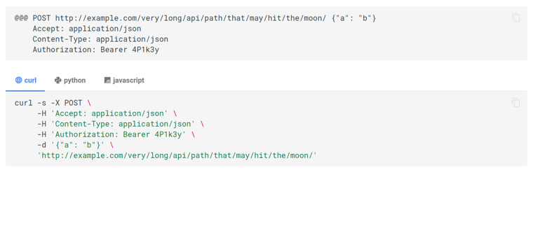

# mkdocs-apicall-plugin

[](https://github.com/asiffer/mkdocs-apicall-plugin/actions/workflows/build.yaml)
[](https://github.com/asiffer/mkdocs-apicall-plugin/actions/workflows/publish.yaml)
[](https://badge.fury.io/py/mkdocs-apicall-plugin)

Auto-generate code samples to make API calls



## Installation

```shell
pip install mkdocs-apicall-plugin
```

This plugin works with the [material](https://squidfunk.github.io/mkdocs-material/) theme and is built on top of the [`tabbed`](https://facelessuser.github.io/pymdown-extensions/extensions/tabbed/) and [`superfenced`](https://facelessuser.github.io/pymdown-extensions/extensions/superfences/) extensions from PyMdown. Enable the extensions and the plugin in your `mkdocs.yml`:

```yaml
theme:
  name: material

markdown_extensions:
  - pymdownx.superfences
  - pymdownx.tabbed:
      alternate_style: true

plugins:
  - apicall
```


## Syntax

The syntax is given below. Basically it may look like a classical HTTP request message.

```md
@@@ <METHOD> <PATH> [<PAYLOAD>]
    [<HEADER-KEY>: <HEADER-VALUE>]
    [<HEADER-KEY>: <HEADER-VALUE>]
```

The method and the paths are both mandatory. 
One can append a payload (only a json for the moment) to the first line.
The following lines are extra indented HTTP headers.

## Configuration

The plugin supports few options:

**`line_length`** [`int`] is the maximum length of a line of code before splitting into several lines.

**`icons`** [`bool`] activates language icons. You must add the following extensions:

```yaml
markdown_extensions:
  # ...   
  - attr_list
  - pymdownx.emoji:
      emoji_index: !!python/name:materialx.emoji.twemoji
      emoji_generator: !!python/name:materialx.emoji.to_svg
```


**`languages`** [`list`] filters the languages to display (show all by default). The order is also taken into account. The term *language* is clearly a misuse as it rather refers to a *way to make the API call* (so we may have `curl`, `wget` along with `typescript` for example). Currently **3 languages** are supported: `curl`, `python` and `javascript`.

As an example you may have:

```yaml
plugins:
  - apicall:
      line_length: 90
      icons: true
      languages:
        - curl
        - python
        - javascript
```

You can also pass extra configuration to a language by adding some sub-keys:

```yaml
plugins:
  - apicall:
      line_length: 90
      icons: true
      languages:
        - curl:
            options:
              - "-s"
        - python
        - javascript
```

Currently only `curl` supports the `options` sub-key to insert some CLI options.

## Contributing

Obviously, we need to dev more *languages*  and increase the number of features: HTTP options, language options, code formatting...

### How?

Open an issue, we may possibly discuss about the requested feature and if we are OK, you can create a branch and submit PR.

### Developing a new language

To add a new language, you have to create a new source code file inside the [mkdocs_apicall_plugin/](https://github.com/asiffer/mkdocs-apicall-plugin/tree/master/mkdocs_apicall_plugin) folder.

Basically a language looks as follows:

```python
from .abstract import APICall


class NewAPICall(APICall):
    # [unique] name of the language. This is what is displayed
    # in the tabs
    name: str = "new"
    # material mkdocs icons (see https://squidfunk.github.io/mkdocs-material/reference/icons-emojis/)
    icon: str = ":material-web:" 
    # Pygments language for syntax highlighting
    # (see https://pygments.org/languages/)
    lang: str = "shell" 
    # Indentation when the call is wrapped into several lines
    # This is just for internal use (so it depends on how you
    # code the language)
    indent: str = " " * 5

    def render_code(self) -> str:
      """Single function to implement. It must return the raw 
      string that will be encapsulated in code blocks and tabs.
      """
      # TODO
```

So, you must implement a subclass of `APICall` and notably the `render_code` method. This method returns only the code as string, 
as you may write in your favorite editor.

You have access to several attributes:

| Attribute          | Type                  | Details                                                                               |
| ------------------ | --------------------- | ------------------------------------------------------------------------------------- |
| `_method`          | `abstract.HttpMethod` | Like `GET` or `POST`. This is always uppercase                                        |
| `_url`             | `str`                 | API endpoint to reach                                                                 |
| `_headers`         | `Dict[str, Any]`      | HTTP headers                                                                          |
| `_body`            | `str`                 | Raw body as string (as it is written in the API call within the markdown source file) |
| `_max_line_length` | `int`                 | Maximum line length desired                                                           |
| `_print_icon`      | `bool`                | Whether the icon will be printed (normally it does have impact on your dev)           |
| `_language_config` | `dict`                | Language specific configuration                                                       |

:warning: You are responsible of the possible default values of the`_language_config` attribute.

:warning: You are encouraged to render code differently according to the value of `_max_line_length`. One may imagine at least an *inline* and a *multiline* rendering.